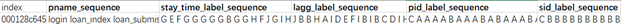

# Fraud Detection with Sequential User Behavior

## Background
One of the reasons why using sequential data is so interesting is that people usually focus on the users’ basic information like gender, age, income, family background, and their application date in the  previous fraud detection analysis. However, some missing factors should also be considered which can be hard to evaluate before but now more and more lending is happening online and the development of Deep Learning techniques can be implemented making the evaluation possible. 

## Data Description
In this project, we have the training dataset and testing dataset, which was provided by the  supervisor. In the training dataset, there are 200000 records of user behaviors data of online loan  applications, while in the testing dataset, there are 30000 such records. Both the two datasets have  the same types of data which showed in the following table. 

### Basic information features (Non-sequential features)  

| Features | Description |
|:--:|:--:|
| label | Reflect if the application defaults or not |
| overdue | Days the loan overdues |
| new_client | Reflect if the applicant is new or not |
| over_time | The submission time of application |

### Page view behavior features (Sequential features) 

| Features | Description |
|:--:|:--:|
| pname | Name of the current page |
| pstime | Starting viewing time on this page  |
| petime | Ending viewing time on this page |
| pid | Process id |
| sid | Session id |

## Data Processing

After examining both the  training dataset and testing dataset, we found that the only difference is  that the labels, i.e. whether this application went default or not, are provided in the training  dataset but not the testing dataset. However, by observation, we find out that in the training  dataset, if ‘overdue’ > 5, the label of that record corresponds to 1, and 0 otherwise. We apply this  to get the labels for the testing dataset. Note that this is not implemented in the original dataset,  so if you are missing the label for the testing data, you may safely undertake the same method to  generate the labels. 

Preprocessing  is necessary since the data cannot be easily fed into deep learning models in its raw format. More details can be found in Data_processing.ipynb.

### Basic information (Non-sequential information)

Since there exists some missing values which might influence our final performance and the amount is small, we’ve dropped them in our preprocessing part, with reference to the results of previous groups. We revamp the non-sequential features a  little bit to keep the index and format in line with our sequential features. We also extract the day of the week and time of the day at which each application was submitted. 

### Page viewing behavior (Sequential information)

For each application, we now have a sequence of words that represent the sequential behavior  during applications. In order to keep the hidden information in the sequence behavior, we  concatenate all the words during the same application together with a white space in between  and form lines of words, which we call sequences. Now we have built up our own language  model, where each application is represented as a sequence of words. 

After separately generating SGT features for each of the sequence variables, we want to capture the interactive relationship between them. There are 5 sequence variables(pname, stay_time, lag_time, pid, sid), and the most important one is pname, so we only consider its interaction with the rest of the variables. 

A combination example can be seen in Figure 5. After combination, the number of all possible values for the combined variable will be the product of the number of all possible values for the two single variables. For this example, the number of all possible values for pname*stay_time will be 3\*3=9. 

  
We have five variables with 11,10,10,3,3 alphabets each. Since the SGT model is space quadratic in alphabet size, simply joining five variables will generate (11\*10\*10\*3\*3)^2=9801000 SGT features, which is too large because of RAM limitation. We choose to combine label sequence variables in pairs so the generated SGT features are reduced to 12100 + 12100 + 1089 + 1089 = 26378 columns together. 

| Single Variables | Alphabet Size | Combined Variables | Alphabet Size | SGT dimensions |
|--|--|--|--|--|
| pname | 11 |  |  |  |
| stay_time | 10 | pname\*stay_time  | 11\*10 | 12100 |
| lagg | 10 | pname\*lagg | 11\*10 | 12100 |
| pid | 3 | pname\*pid | 11\*3 | 1089 |
| sid | 3 | pname\*sid | 11\*3 | 1089 |

In order to overcome the RAM limitation problem, we choose to only capture the interaction relationship in pairs. However, the generated SGT features are still too large to feed into a classifier, so the PCA method was applied for each of these 4 combined sequences to reduce dimensions. But the problem is it’s even too hard to apply the PCA method since the generated SGT features are too large(will take up too much memory and days to run). We find the stay_time and lagg are actually continuous variables and previous groups transform them into categorical variables with 10 categories. Therefore, we can reduce the categories, i.e. from 10 to 5, before using PCA so that the number of generated SGT dimensions can be reduced.

## Sequence Graph Transform (SGT) model
In general,  <a href="https://arxiv.org/pdf/1608.03533.pdf">SGT model</a> is a sequence feature embedding function, and can extract both short-term and long-term dependencies. You may refer to the original essay or Fall 2020 final report to find its theory details. Here a simple example is given for intuitive illustration. 

Consider a list ["B","B","A","C","A","C","A","A","B","A"], the extracted SGT features can be seen in figure below. The alphabet order in a feature (i, j) indicates the forward dependency from i to j: a high value of feature indicates a high forward dependency, i.e., i is followed by a significant amount of j's in the sequence.

| Pairs | Value |
|--|--|
| (A, A) | 0.090616 |
| (A, B) | 0.131002 |
| (A, C) | 0.261849 |
| (B, A) | 0.086569 |
| (B, B) | 0.123042 |
| (B, C) | 0.052544 |
| (C, A) | 0.137142 |
| (C, B) | 0.028263 |
| (C, C) | 0.135335 |

## CatBoost model using SGT features
After generating SGT features, we introduce a model called CatBoost here. The CatBoost model is a GBDT model that is widely used in kaggle competition, along with XGBoost and LightGBM, etc. You may refer to the <a href="https://arxiv.org/pdf/1706.09516.pdforiginal">original essay</a> for theory details. Among all attempts, the CatBoost model shows the best performance, and one reason for this is the CatBoost model can automatically make combinations of variables when making predictions.

| Model | AUC | KS |
|--|--|--|
| LightGBM | 0.6430 | 0.2170 |
| CatBoost | 0.6493 | 0.2200 |
